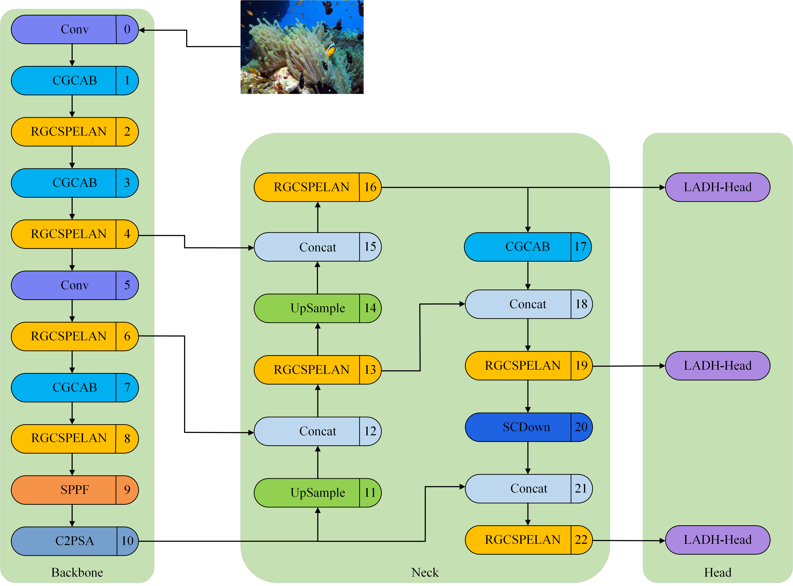
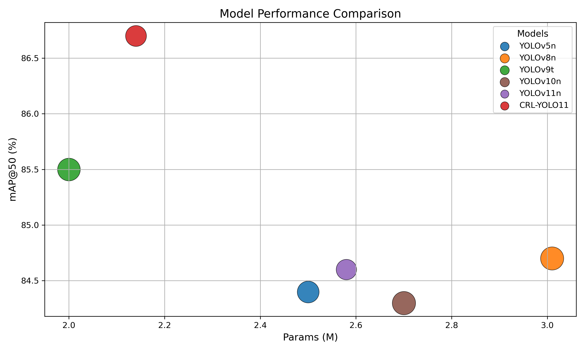

# 🐟 CRL-YOLO11：

CRL-YOLO11 is a lightweight object detection algorithm designed for complex underwater environments. It is specifically optimized for challenges such as low contrast, small targets, and degraded edge details. Built upon the YOLOv11 architecture, CRL-YOLO11 integrates edge-aware enhancement and multi-scale feature fusion modules, striking a balance between accuracy, efficiency, and model size. This makes it suitable for real-time underwater detection and deployment on edge devices.

---

## ✨ Key Features

- 🔍 **Edge-Aware and Context-Guided Attention Module (CGCAB)**  
  Combines standard and dilated convolutions to extract both local details and global context, and introduces Coordinate Attention (CA) to enhance the modeling of weak features and edge details.

- 🧩 **Lightweight Feature Aggregation Module (RGCSPELAN)**  
  Uses a re-parameterized multi-branch structure for efficient cross-scale semantic fusion, enhancing detection performance for small objects while reducing parameter redundancy.

- ⚙️ **Lightweight Asymmetric Decoupled Head (LADH-Head)**  
  Incorporates DSConv in the regression branch to reduce computation and uses point-wise convolutions in the classification branch to improve channel-wise feature interaction, enabling a symmetric and lightweight detection head.

- 📉 **Fewer Parameters, Faster Inference, Higher Accuracy**  
  Compact and fast, CRL-YOLO11 is ideal for deployment on embedded platforms or real-time detection scenarios.


---

## 🧠 Network Architecture

Below is the structural illustration of the CRL-YOLO11 model:


---

## 📊 Comparative Evaluation Across Algorithms

Experiments were conducted on a self-built dataset. CRL-YOLO11 demonstrates superior performance in terms of detection accuracy and parameter efficiency compared to mainstream lightweight models.



---


## 📁 Project Structure

```bash
CRL-YOLO11/
├── datasets/            # Dataset and annotations
├── models/              # Model definitions (CGCAB, RGCSPELAN, LADH-Head)
├── weights/             # Pretrained weights
├── inference/           # Inference scripts and test images
├── assets/              # Visualizations (network structure, results)
├── train.py             # Training script
├── detect.py            # Inference and evaluation script
└── README.md            # Project documentation
````

---

## 🛠️ Environment Requirements

* Python = 3.11.9
* PyTorch = 2.1.1
* CUDA = 11.8
* timm >= 1.0.7

Install dependencies via:

```bash
pip install -r requirements.txt
```

---

---

## 📂 Datasets

This project utilizes three datasets for training and evaluation:

- **🔧 Self-Built Dataset**  
  Collected and annotated for realistic underwater conditions, featuring challenges such as low contrast, blurred edges, occlusions, and small targets. It includes diverse species and complex backgrounds.

- **🐠 [Kaggle-Fish Dataset](https://www.kaggle.com/datasets) (Public)**  
  A widely-used public dataset containing various fish species under different lighting and environmental conditions, used to validate generalization ability.

- **🌊 [URPC2019 Dataset](https://www.cnurpc.org/) (Underwater Robot Picking Contest)**  
  A benchmark dataset designed for underwater robotics tasks, including annotated underwater targets such as fish and marine organisms. Useful for testing robustness in real-world scenarios.


## 📈 Performance Comparison Table

| Model          | mAP50 (%) | mAP50-95 (%) | Params (M) | FLOPs (G) | Precision (%) | Recall (%) | FPS       | Weights (MB) |
| -------------- | --------- | ------------ | ---------- | --------- | ------------- | ---------- | --------- | ------------ |
| Faster R-CNN   | 70.2      | 47.7         | 136.8      | 369.3     | 80.3          | 73.4       | 36.8      | 528          |
| DETR           | 84.7      | 58.0         | 42.0       | 125.6     | 87.2          | 76.9       | 9.6       | 82.0         |
| YOLOv5n        | 84.4      | 59.3         | 2.5        | 7.2       | 89.7          | 72.6       | 183.8     | 5.0          |
| YOLOv8n        | 84.7      | 59.8         | 3.01       | 8.1       | 85.8          | 76.9       | 201.6     | 6.0          |
| YOLOv9t        | 85.5      | 60.8         | 2.0        | 7.8       | 87.0          | 76.5       | 80.2      | 4.4          |
| YOLOv10n       | 84.3      | 59.7         | 2.7        | 8.2       | 87.3          | 75.1       | 155.4     | 5.5          |
| YOLOv11n       | 84.6      | 60.3         | 2.58       | 6.3       | 86.8          | 76.0       | 148.2     | 5.2          |
| **CRL-YOLO11** | **86.7**  | **61.1**     | **2.14**   | **6.6**   | **85.9**      | **78.9**   | **122.7** | **4.5**      |

```
````

## 🔧 Inference & Training Guide

### 🧪 Step-by-Step Instructions

#### ✅ Step 1: Install Dependencies

Navigate to the root directory where `pyproject.toml` is located and run:

```bash
pip install -e .
````

#### 📁 Step 2: Prepare Dataset

Download the required dataset and update the dataset configuration files located in:

```
cfg/datasets/
```

#### 🧠 Step 3: Select Model Configuration

Choose your desired model configuration from:

```
cfg/models/
```

#### 🚀 Step 4: Train the Model

Run the training script:

```bash
python train.py
```

#### 📊 Step 5: Evaluate the Model

Run the evaluation script:

```bash
python val.py
```

---


---

### 🔑 Keywords ：


Underwater object detection; YOLOv11; edge awareness; context guidance; multi-scale feature fusion; lightweight network; fish detection

---

## 📬 Contact

If you have any questions, suggestions, or would like to contribute to this project, feel free to reach out:

- 📧 Email: hebq@ctgu.edu.cn  


We welcome feedback and collaboration!


